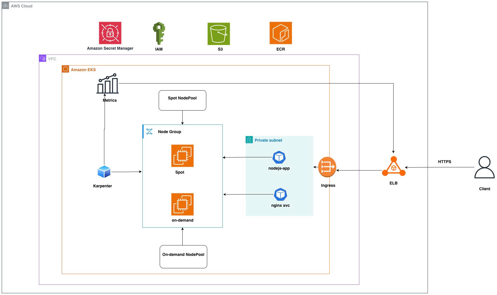

# EKS + Karpenter + NodeJS + HPA + k6

[Diagram Architecture](https://drive.google.com/file/d/1ilr1hH4_Eoe_NvsTnTScl0z4vSisl1JX/view?usp=sharing)



This repository contains a complete demo to provision an **Amazon EKS** cluster with **Terraform**, install **Karpenter**, deploy a simple **Node.js** app (GET `/time`), configure **Ingress (nginx) + TLS**, configure **HPA** and provide a **k6** load test script that ramps traffic to observe autoscaling behavior. It also includes a managed node group `core` (for control/infra pods) and uses Karpenter provisioners for spot and on-demand nodes.

---

## Repo layout

```
eks-karpenter-terraform-repo/
├── README.md
├── terraform/
│   ├── modules/
│   ├── providers.tf
│   ├── variables.tf
│   ├── backend.tf
│   ├── main.tf
│   ├── locals.tf
│   ├── terraform.tfvars
│   ├── outputs.tf
│   └── versions.tf
│   └── README.md
├── k8s/
│   ├── karpenter/
│   │   ├── provisioner-spot.yaml
│   │   └── provisioner-ondemand.yaml
│   ├── certs/              # optional helpers
│   │   └── tls.crt
│   │   └── tls.key
│   ├── ingress-nginx/             # optional config
│   │   └── ingress.yaml
│   │   └── nginx-hpa.yaml
│   ├── app/
│   │   ├── deployment.yaml
│   │   ├── service.yaml
│   │   └── hpa.yaml
├── app/
│   ├── Dockerfile
│   ├── package.json
│   └── server.js
├── k6/
│   └── ramp-up.js
└── scripts/
    ├── 00-setup-env.sh
    └── 01-terraform-init.sh
    └──...
```

---

## Explanation

- **Terraform** provisions a VPC, EKS cluster and a _managed node group_ called `core` used for infra and control-plane-adjacent workloads (CB/metrics, cert-manager, ingress-controller etc.).
- **Karpenter** installed into the cluster (Helm via `kubectl` provider or by `helm` provider) with two `Provisioner` CRs:

  - `spot`: for `nodejs` workload — uses Spot instances, labeled `karpenter.k8s.aws/node-pool=nodejs`, tainted with `dedicated=nodejs:NoSchedule`.
  - `ondemand`: for `nginx` workload — uses on-demand instances and labeled `karpenter.k8s.aws/node-pool=nginx`.

- **Pod scheduling control** via labels and taints + nodeSelector/tolerations in Pod specs.
- **Ingress**: nginx ingress controller (deployed in `core` nodegroup, or via Helm) and TLS via a Kubernetes secret.
- **HPA** for both NodeJS app and nginx (ingress) — scales based on CPU utilization. Karpenter will react to unschedulable pods by provisioning nodes.
- **k6**: ramp-up load script that gradually increases virtual users to force autoscaling.

---

## Scripts

- `scripts/01-setup-env.sh` — setup aws config environment
- `scripts/02-terraform-init.sh` — Terraform initialization and validation.
- `scripts/02-terraform-apply.sh` — Terraform plan and apply to provisioning infras.
- `scripts/03-install-cert-manager.sh` — Apply cert-manager manifest to install TLS/SSL in k8s cluster.
- `scripts/04-create-tls-secret.sh` — Create TLS secret (self-signed for testing)
- `scripts/05-build-push-ecr.sh` — build Docker image and push to ECR
- `scripts/06-deploy-app.sh` — deploy nginx ingress and app deployment - service - hpa to k8s cluster
- `scripts/07-karpenter-mix-spot-on-demand.sh` — Apply Karpenter Provisioners (Spot + On-Demand)
- `scripts/08-run-k6-test.sh` — ramp-up load script that gradually increases virtual users to force autoscaling.
- `scripts/99-destroy-all.sh` — Terraform destroy all resources.

## Observability - Basic metrics/logging

- Install **AWS CloudWatch Container Insights** or use the EKS module's `cluster_logging` options to send logs to CloudWatch.
- Install `prometheus` and `grafana` (Helm) and setting up basic CPU/Memory dashboards. Prometheus can be used to drive HPA with custom metrics as well.
- Karpenter metrics can be observed via the `karpenter` controller logs and CloudWatch (if controller pushes logs) or `kubectl -n karpenter logs deploy/karpenter`.

---

## Quick run checklist

1. Configure AWS credentials locally:

```bash
bash scripts/00-setup-env.sh
```

2. Edit `terraform/terraform.tfvars` and set `cluster_name`, `aws_region`, `karpenter_version` then run:

```bash
bash scripts/01-terraform-init.sh
```

3. Creates VPC + EKS + core managed nodegroup:

```bash
bash scripts/02-terraform-apply.sh
```

4. Install cert-manager:

```bash
bash scripts/03-install-cert-manager.sh
```

5. Create TLS secret (ensure Ingress is created):

```bash
bash scripts/04-create-tls-secret.sh
```

6. Build and push Docker image:

```bash
bash scripts/05-buid-push-ecr.sh
```

7. Deploy the app manifests:

```bash
bash scripts/06-deploy-app.sh
```

8. Apply Karpenter provisioners (mix spot and on-demand)

```bash
bash scripts/07-karpenter-mix-spot-on-demand.sh
```

9. Run k6 load test:

```bash
bash scripts/08-run-k6-test.sh
```

10. Destroy all resources infras:

```bash
bash scripts/99-destroy-all.sh
```

---

## Notes (TODO):

### Zero-Downtime Deployment Strategy (Future Plan)

1. Rolling Updates via Kubernetes
   - Use maxUnavailable=0 and maxSurge=1 in Deployment strategies.
   - This ensures a new pod is created before the old one is terminated.
2. Blue-Green or Canary Deployments

   - Gradually shift traffic between versions using Ingress annotations or service routing.
   - Integrate with CI/CD tools like Argo Rollouts or Flux for controlled releases.

3. Autoscaling with Graceful Degradation
   - Combine HPA (Horizontal Pod Autoscaler) and Karpenter scaling to ensure smooth workload transitions.
   - Allow sufficient cooldown periods to avoid thrashing between scaling events.
